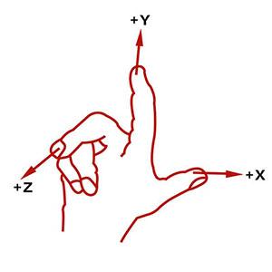
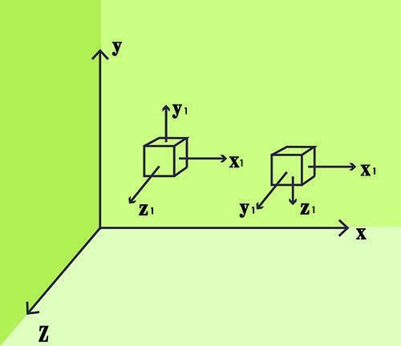

数学基础：<https://juejin.cn/book/6844733759326158861/section/6844733759401492494>

# 世界坐标系

右手手势确定（右手定则）

# 自身坐标系（物体坐标系）

上图中 X-Y-Z 坐标系是世界坐标系，X1-Y1-Z1 坐标系为小方块的自身坐标系，刚开始左侧小方块的自身坐标系的 X1 轴、Y1 轴、Z1 轴和世界坐标系的 X 轴、Y 轴、Z 轴方向相同；但是当小方块绕着自身坐标系的 X1 轴向下旋转 90 度之后，如上图中右侧所示其自身坐标系也会跟着小方块旋转，因此**小方块和它的自身坐标系的关系并没有变化。**

